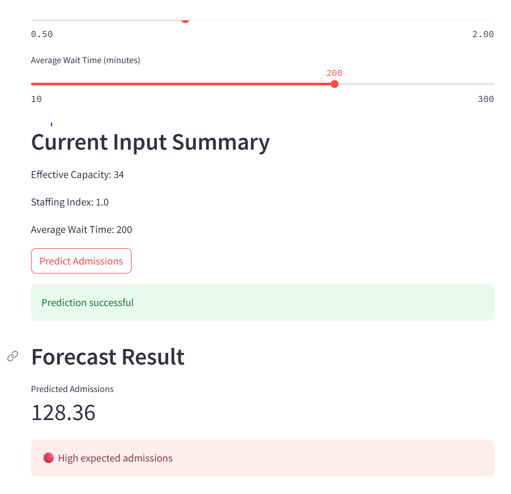

# MedOptix HealSight – Hospital Admissions Forecasting System

## Short Overview
MedOptix HealSight is an end ‑to‑end healthcare analytics platform that predicts hospital admissions for the next 30 days. It combines time‑series forecasting with machine learning and exposes the results through an API and an interactive dashboard.

## Business Problem
Hospitals need to forecast admissions to manage capacity, staffing and resources efficiently. Without reliable predictions, they risk long wait times, resource bottlenecks and under‑ or over‑staffing.

## Solution / Project Purpose
The project addresses these challenges by:
- Processing historical admissions data to uncover trends and seasonality.
- Building predictive models (SARIMAX and Random Forest) to forecast future admissions.
- Exposing predictions via a FastAPI endpoint.
- Visualising insights in a Streamlit dashboard so non‑technical users can explore scenarios.
- Packaging everything in Docker for reproducibility and easy deployment.

## Key Features
- 30‑day hospital admission forecasts with confidence intervals.
- Adjustable parameters (e.g. capacity, staffing levels, wait times) to test different scenarios.
- Risk classification of admission levels (Low, Medium or High).
- Interactive time‑series visualisations.
- REST API for real‑time predictions.

## Tools and Technologies
- Python with Pandas, NumPy, Statsmodels (SARIMAX) and Scikit‑learn.
- FastAPI for the prediction service.
- Streamlit for the dashboard.
- Docker and Docker Compose for containerisation.

## Workflow / Method
1. **Data engineering:** clean and aggregate historical hospital data.
2. **Model building:** train SARIMAX and Random Forest models on the prepared data.
3. **API deployment:** serve the models through a FastAPI endpoint.
4. **Dashboard development:** build a Streamlit app to explore forecasts and adjust parameters.
5. **Containerisation:** bundle the API and dashboard in Docker for consistent deployment.

## Key Insights or Outcomes
The forecasts show clear seasonal demand patterns and recent trends in hospital admissions. Decision‑makers can use these insights to plan capacity and staffing more effectively.

## Business or Practical Impact
By predicting upcoming admission levels and highlighting potential resource constraints, the system supports data‑driven operational planning. Hospitals can align staffing and capacity to anticipated demand, reducing wait times and improving patient care.

## Visual Outputs
### Dashboard Preview
<p align="center">
  
</p>

### API Preview
<p align="center">
  
</p>

### Docker Deployment
<p align="center">
  
</p>

## Project Structure
```
medoptix-healsight/
├── app.py                 # FastAPI app
├── dashboard.py           # Streamlit dashboard
├── docker-compose.yml
├── Dockerfile.api
├── Dockerfile.dashboard
├── requirements.txt
├── model/
│   ├── inference.py
│   └── train_model.py
├── notebooks/
│   └── 02_eda.ipynb
├── images/                # Dashboard screenshots
└── README.md
```

## How to Run or View
To start the API and dashboard locally using Docker:

```bash
docker compose up --build
```

Then open in your browser:
- Dashboard – http://localhost:8501  
- API docs – http://localhost:8000/docs

## Future Improvements
- Incorporate external factors (e.g. weather, holidays) into the forecasts.
- Deploy to cloud platforms such as AWS or Azure.
- Add support for ingesting new data in real time.
