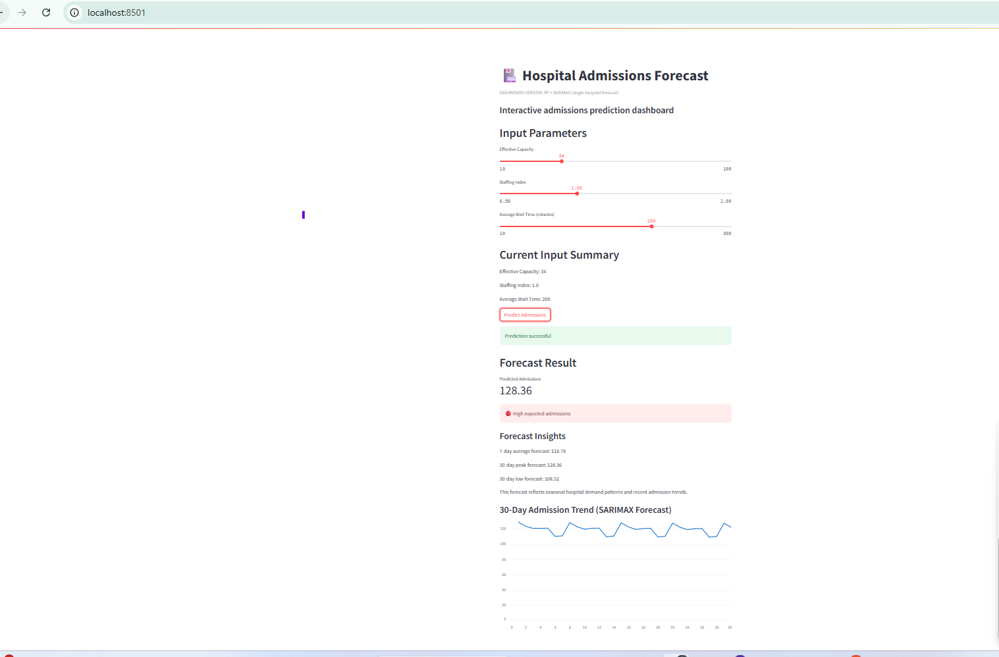
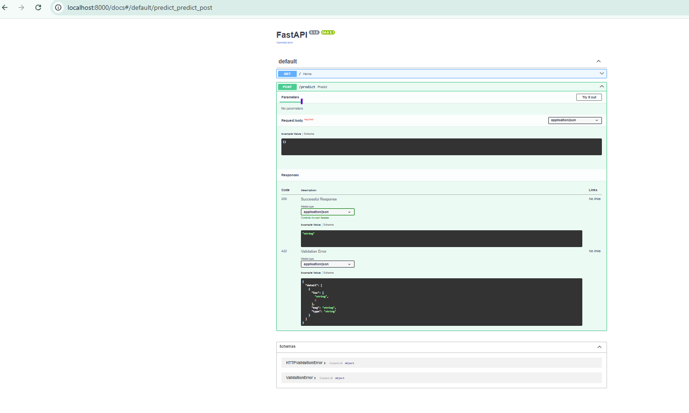
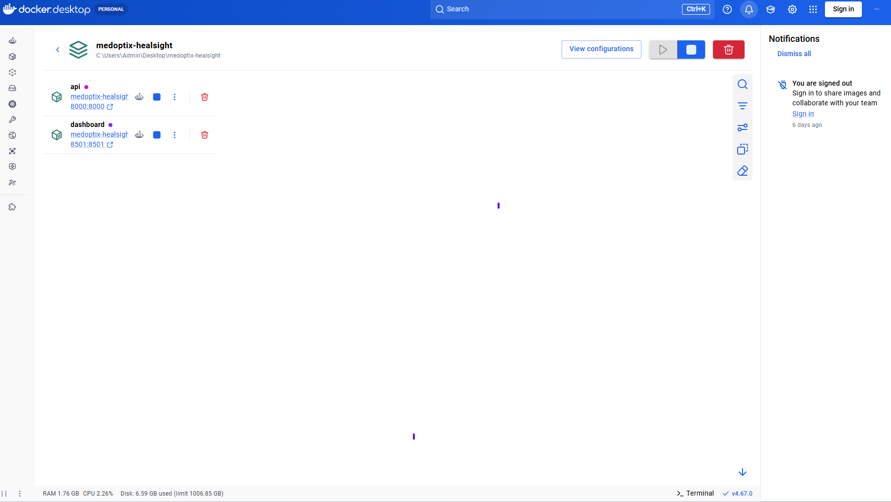

# 🏥 MedOptix HealSight – Hospital Admissions Forecasting System

## 🚀 Overview

MedOptix HealSight is an end-to-end healthcare analytics system designed to predict hospital admissions using machine learning and time series forecasting.

It simulates a real-world hospital operations environment by combining:

- Data engineering  
- Forecast modelling (SARIMAX + Machine Learning)  
- API deployment (FastAPI)  
- Interactive dashboard (Streamlit)  
- Containerisation (Docker)  

---

## 🎯 Business Problem

Hospitals face ongoing challenges in:

- Managing patient flow efficiently  
- Allocating staff and resources  
- Reducing patient wait times  
- Planning for demand spikes  

This project predicts future hospital admissions to support **data-driven operational decision-making and resource planning**.

---

## 🧠 Solution

The system:

1. Processes historical hospital data  
2. Builds predictive models (SARIMAX + Random Forest)  
3. Exposes predictions via a FastAPI endpoint  
4. Visualises insights through an interactive dashboard  
5. Runs fully in Docker for reproducibility  

---

## 🏗️ Architecture

```
User (Dashboard)
   ↓
Streamlit Dashboard (Port 8501)
   ↓
FastAPI Service (Port 8000)
   ↓
ML Model (SARIMAX + Feature Inputs)
```

---

## 🛠️ Tech Stack

- Python  
- Pandas / NumPy  
- Statsmodels (SARIMAX)  
- Scikit-learn  
- FastAPI  
- Streamlit  
- Docker & Docker Compose  

---

## 📊 Features

- 📈 30-day hospital admission forecasting  
- ⚙️ Adjustable operational parameters (capacity, staffing, wait time)  
- 🚦 Admission risk classification (Low / Medium / High)  
- 📉 Time series trend visualisation  
- 🔌 REST API for real-time predictions  

---

## 📸 Dashboard Preview



## 🔌 API Preview



## 🐳 Docker Preview


---

## 🧪 API Example

**POST `/predict`**

```json
{
  "capacity": 40,
  "staffing_index": 1.0,
  "avg_wait_time": 200
}
```

---

## 🐳 Run with Docker

```bash
docker compose up --build
```

Then open:

- Dashboard → http://localhost:8501  
- API Docs → http://localhost:8000/docs  

---

## 📂 Project Structure

```
medoptix-healsight/
│
├── app.py                  # FastAPI app
├── dashboard.py            # Streamlit dashboard
├── docker-compose.yml
├── Dockerfile.api
├── Dockerfile.dashboard
├── requirements.txt
│
├── model/
│   ├── inference.py
│   └── train_model.py
│
├── notebooks/
│   └── 02_eda.ipynb
│
├── images/                 # Dashboard screenshots
│
└── README.md
```

---

## 📌 Key Insight

This forecast reflects seasonal hospital demand patterns and recent admission trends, enabling better planning of hospital capacity and staffing levels.

---

## 👨‍💻 Author

Built as part of a real-world analytics portfolio demonstrating:

- End-to-end data pipeline design  
- Time series forecasting & machine learning  
- API development and deployment  
- Interactive dashboard integration  

---

## 🚀 Next Steps

- Extend model with external factors (weather, holidays)  
- Deploy to cloud (AWS / Azure)  
- Add real-time data ingestion  

---